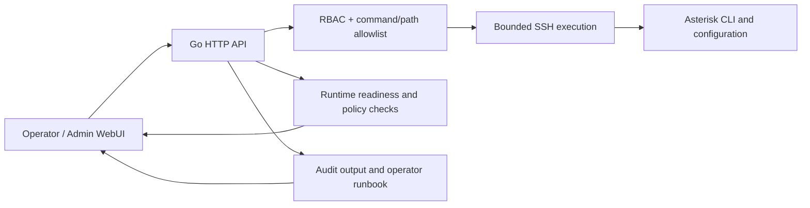

# Asterisk SSH WebUI — capability showcase

Безопасная демонстрация авторского WebUI для эксплуатации Asterisk через SSH.
Репозиторий содержит только обезличенные скриншоты и описание возможностей —
без исходного кода, конфигурации АТС, адресов инфраструктуры и учётных данных.

## Что демонстрирует проект

- единое рабочее место оператора с health/readiness/runtime-policy;
- PJSIP endpoint и trunk inventory;
- runtime очередей и явный owner/source-of-truth слой;
- RBAC и разделение простого/инженерного режима;
- безопасные изменения: pre-check, backup, validate, reload, acceptance, rollback;
- расписания и after-hours маршрутизация;
- operator runbook и evidence-first диагностика;
- DHCP/provisioning/notifier/XMPP как отдельные проверяемые подсистемы;
- адаптивный интерфейс для рабочего места и мобильного просмотра.

## Галерея

### PJSIP endpoint и trunk inventory

### Runtime очередей и policy ownership

### Карта слоёв и источников истины

### Операторский runbook

### Расписание и безопасное применение

### Мобильное рабочее место

## Архитектурный подход

Главный принцип: интерфейс не подменяет эксплуатационную дисциплину. Опасное
изменение допускается только после pre-check и backup, а завершённым считается
после runtime/business acceptance с понятным rollback.

## Достоверность и безопасность демонстрации

Все кадры созданы Playwright при полном перехвате `/api/*` и использовании
синтетических данных. Приложение было запущено с недоступной loopback SSH-целью;
соединение с production АТС не выполнялось. Каждый скриншот явно помечен
`DEMO · SYNTHETIC DATA · NO PRODUCTION CONNECTION`.

Адреса из диапазонов `192.0.2.0/24` и `198.51.100.0/24` — специальные
документационные сети RFC 5737, а не реальные узлы.

## Как показывать на собеседовании

- Краткий сценарий: [docs/DEMO_SCRIPT_RU.md](docs/DEMO_SCRIPT_RU.md).
- Инженерные решения: [docs/ENGINEERING_NOTES_RU.md](docs/ENGINEERING_NOTES_RU.md).

## Правовой режим

Скриншоты демонстрируют проприетарное авторское ПО. Публикация этого showcase
не предоставляет право копировать, распространять или создавать производные
версии исходного продукта. © 2026 Игорь Рачков. All rights reserved.
