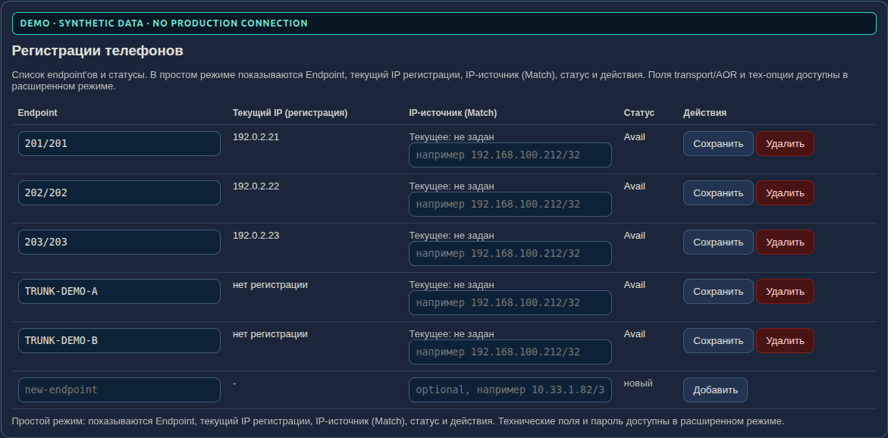
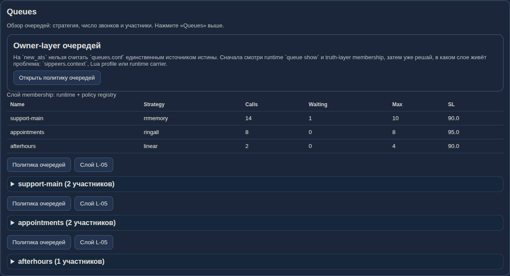
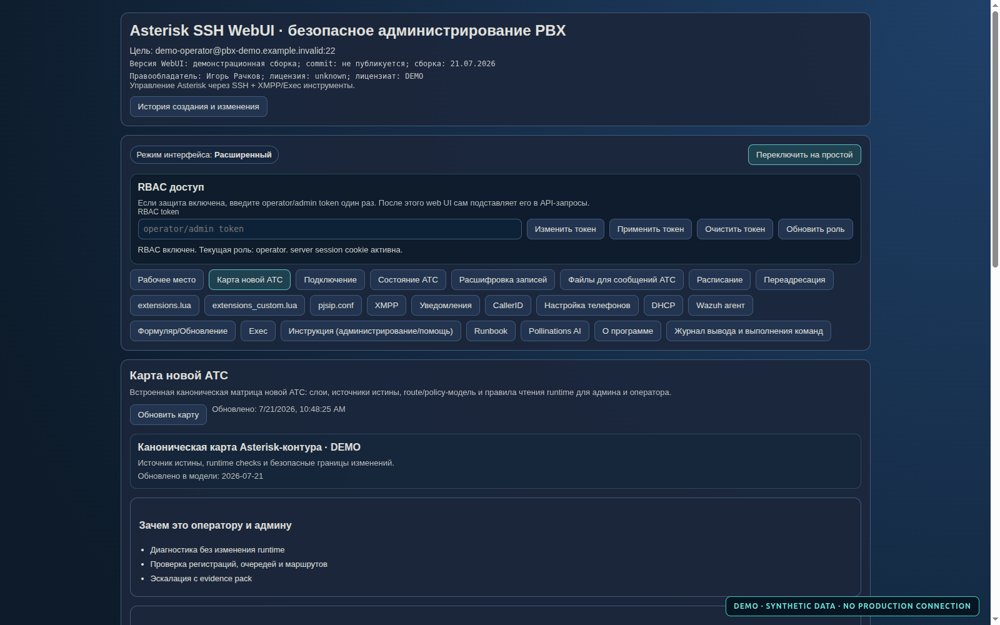
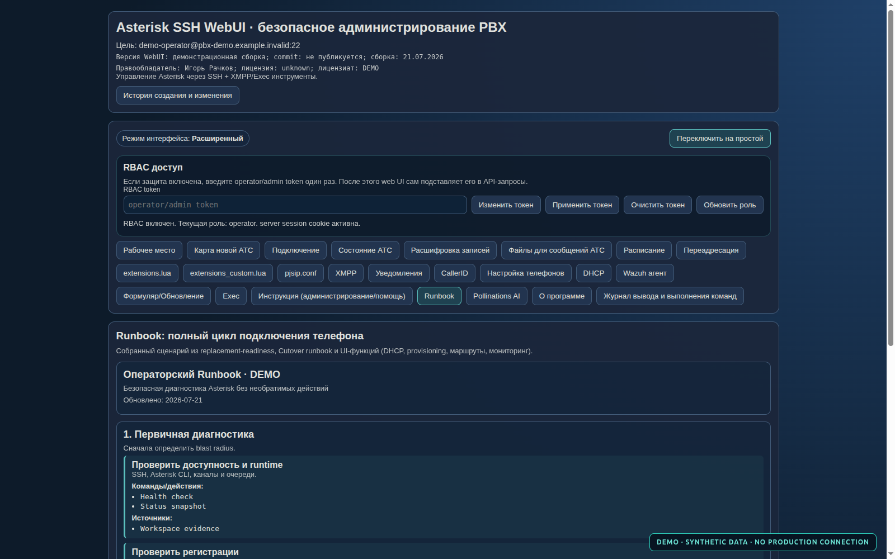
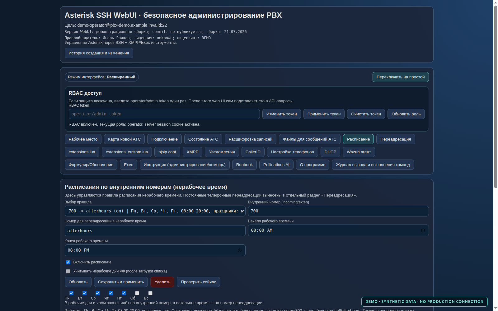
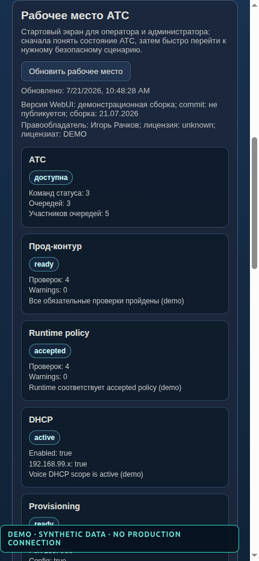
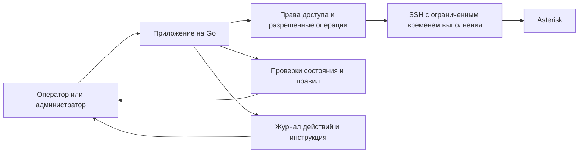

# Портфолио Игоря Рачкова

Здравствуйте. Меня зовут Игорь Рачков. Я занимаюсь инфраструктурой,
автоматизацией и эксплуатацией систем, от которых зависит повседневная работа
людей: серверов, сетевых сервисов, телефонии, мониторинга и внутренних
приложений.

В этом репозитории я собираю примеры своих работ. Мне важно показывать не только
готовый экран или фрагмент кода, но и ход инженерной мысли: какую проблему я
решал, чего хотел избежать, как проверял результат и что предусмотрел на случай
ошибки.

## Первый проект: Asterisk SSH WebUI

Это веб-интерфейс для администрирования Asterisk через SSH. Я начал делать его,
чтобы сократить количество повторяющихся ручных действий и дать оператору
понятное рабочее место вместо набора команд, конфигурационных файлов и разрозненных
инструкций.

На стартовом экране видно состояние самой АТС и связанных с ней служб. Если
что-то не готово, интерфейс не просто показывает ошибку, а подсказывает, с какой
проверки начать.

### Что я реализовал

- просмотр состояния Asterisk, телефонных аппаратов, внешних линий и очередей;
- разделение обычного и инженерного режима, чтобы повседневные действия не
  смешивались с опасными настройками;
- разграничение доступа между оператором и администратором;
- проверку готовности рабочего контура и соответствия фактической конфигурации
  принятым правилам;
- управление расписаниями и маршрутизацией звонков в нерабочее время;
- отдельные проверки DHCP, автоматической настройки телефонов, уведомлений и
  XMPP;
- встроенную инструкцию, которая ведёт оператора от первичной диагностики к
  безопасному изменению;
- резервное копирование, проверку синтаксиса и возможность отката перед
  применением изменений;
- автоматические проверки backend и интерфейса.

### Телефоны и внешние линии

Регистрация аппарата отделена от сетевого правила, по которому Asterisk узнаёт
источник. Это помогает не смешивать две разные причины неисправности.

### Очереди звонков

Интерфейс показывает не только текущее состояние очереди, но и то, откуда
должен браться её состав. Такой подход помогает заметить расхождение между
рабочей конфигурацией и принятыми правилами.

### Как устроена система

Для сложной АТС недостаточно знать имя конфигурационного файла. В интерфейсе я
зафиксировал слои системы, источники достоверной информации и безопасные способы
проверки каждого слоя.

### Инструкция рядом с инструментом

Операторская инструкция встроена в приложение. Она предлагает сначала понять
масштаб сбоя и собрать факты, затем внести изменение и обязательно проверить
результат.

### Расписание работы

Расписание можно изменить без ручного редактирования базы и dialplan. Перед
применением создаётся резервная копия, проверяется синтаксис, после чего
выполняется узкая перезагрузка нужного модуля.

### Мобильный вид

Основная информация остаётся читаемой на небольшом экране. Это удобно для
быстрой проверки состояния, но сложные изменения я по-прежнему считаю задачей
для полноценного рабочего места.

## Несколько слов об архитектуре

Главный принцип проекта прост: интерфейс должен уменьшать количество ручной
работы, но не скрывать риск. Перед опасным изменением нужно сохранить исходное
состояние и подготовить откат. После изменения нужно проверить не только сервис,
но и реальный сценарий звонка.

Подробнее о проекте: [как устроен Asterisk SSH WebUI](docs/ASTERISK_SSH_WEBUI_RU.md).

## Как я показываю этот проект

Для короткого рассказа на собеседовании подготовлен
[семиминутный сценарий](docs/DEMO_SCRIPT_RU.md). Он помогает не перечислять
кнопки, а объяснить, какие эксплуатационные проблемы решает приложение.

## О демонстрационных данных

На скриншотах нет данных действующей АТС. Во время съёмки браузер получал только
заранее подготовленные ответы, а соединение с рабочими серверами не выполнялось.
Все изображения имеют явную отметку `DEMO · SYNTHETIC DATA`.

Адреса из диапазонов `192.0.2.0/24` и `198.51.100.0/24` зарезервированы для
документации и примеров по RFC 5737.

## Авторские права

Asterisk SSH WebUI — моё проприетарное программное обеспечение. Этот репозиторий
предназначен для знакомства с моей работой и не содержит исходного кода
продукта. © 2026 Игорь Рачков.
