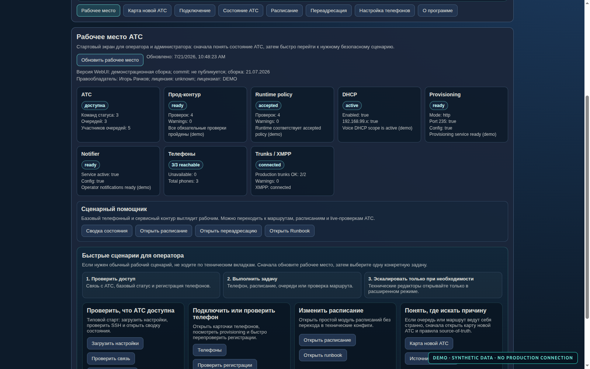

# Asterisk SSH WebUI: безопасное управление телефонией

Это один из моих проектов, а не полное описание профессионального опыта. Здесь
я показываю конкретный пример того, как знания эксплуатации можно превратить в
инструмент для другого специалиста.

## Почему я выбрал Go и SSH

Backend написан на Go. Получился один исполняемый файл без отдельного окружения
интерпретатора и большого набора зависимостей. Это удобно для небольшого
внутреннего инструмента, который должен предсказуемо запускаться как системная
служба.

Приложение обращается к Asterisk по SSH. Команды выполняются с ограниченным
временем ожидания. Для штатных операций используются заранее определённые
команды и пути — обычный пользователь не получает произвольную командную строку
на сервере.

## Почему в интерфейсе два режима

Большинство ежедневных задач сводится к проверке состояния, аппаратов, очередей
и расписания. Редактирование dialplan, PJSIP и служебных конфигураций требуется
реже и несёт больший риск. Поэтому в простом режиме я оставил понятные
операторские действия, а технические редакторы вынес в инженерный режим.

Дополнительно права оператора и администратора разделены на уровне API. Скрытой
кнопки недостаточно: backend также должен отклонить запрещённую операцию.

## Как защищены изменения

Перед записью конфигурации приложение сохраняет исходный файл. Затем проверяет
синтаксис и только после этого выполняет узкую перезагрузку нужного модуля.
Если применение не удалось, предусмотрено восстановление предыдущей версии.

Я считаю изменение законченным только после повторной проверки состояния и
рабочего сценария. Успешный ответ службы сам по себе ещё не доказывает, что
звонок проходит по нужному маршруту.

## Зачем нужна карта источников

В Asterisk одно и то же поведение может зависеть от PJSIP, Lua dialplan, базы
данных и текущего состояния процесса. Поиск по имени номера часто приводит не к
тому слою, который действительно владеет правилом. Карта системы показывает,
где искать фактическое состояние, ожидаемое правило и причину расхождения.

## Проверка качества

Backend проверяется тестами Go, форматированием и статическим анализом. Основные
сценарии интерфейса проходят в Playwright. Для скриншотов из этого портфолио API
полностью заменён синтетическими ответами, поэтому результат воспроизводим и не
зависит от доступности действующей АТС.

## Демонстрационные экраны

- [телефоны и внешние линии](../screenshots/02-endpoints-and-trunks.png);
- [очереди и источник правил](../screenshots/03-queues-runtime-policy.png);
- [карта устройства системы](../screenshots/04-system-source-of-truth-map.png);
- [встроенная инструкция](../screenshots/05-operator-runbook.png);
- [расписание и безопасное изменение](../screenshots/06-schedule-and-safe-change.png);
- [мобильный вид](../screenshots/07-mobile-operator-workspace.png).

## Что эти материалы не доказывают

Скриншоты показывают реализованный интерфейс и принятые инженерные решения. Они
не являются отчётом о доступности конкретной АТС, её нагрузке или выполнении SLA.
Все значения на изображениях демонстрационные.
